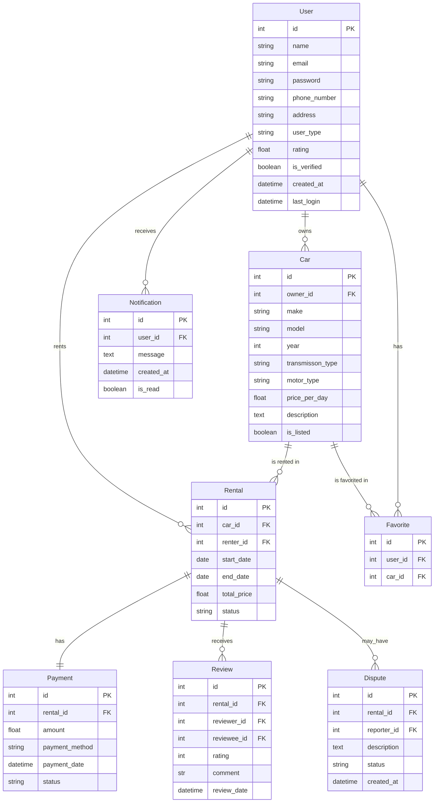

```mermaid
erDiagram
    User ||--o{ Car : owns
    User ||--o{ Rental : rents
    User {
        int id PK
        string name
        string email
        string password
        string phone_number
        string address
        string user_type
        float rating
        boolean is_verified
        datetime created_at
        datetime last_login
    }
    Car ||--o{ Rental : "is rented in"
    Car ||--o{ Favorite : "is favorited in"
    Car {
        int id PK
        int owner_id FK
        string make
        string model
        int year
        string transmisson_type
        string motor_type
        float price_per_day
        text description
        boolean is_listed
    }
    Rental {
        int id PK
        int car_id FK
        int renter_id FK
        date start_date
        date end_date
        float total_price
        string status
    }
    Payment {
        int id PK
        int rental_id FK
        float amount
        string payment_method
        datetime payment_date
        string status
    }
    Review {
        int id PK
        int rental_id FK
        int reviewer_id FK
        int reviewee_id FK
        int rating
        str comment
        datetime review_date
    }
    Favorite {
        int id PK
        int user_id FK
        int car_id FK
    }
    Notification {
        int id PK
        int user_id FK
        text message
        datetime created_at
        boolean is_read
    }
    Dispute {
        int id PK
        int rental_id FK
        int reporter_id FK
        text description
        string status
        datetime created_at
    }
    Rental ||--|| Payment : has
    Rental ||--o{ Review : receives
    User ||--o{ Favorite : has
    User ||--o{ Notification : receives
    Rental ||--o{ Dispute : may_have
```
