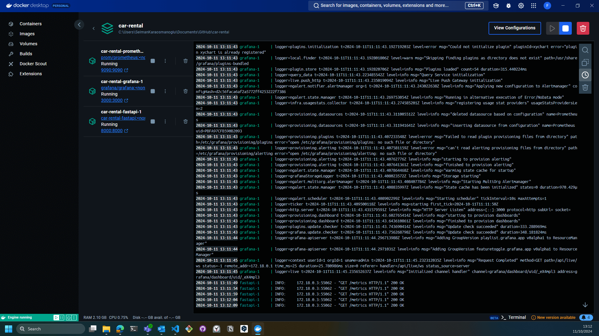
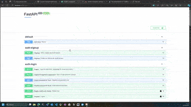
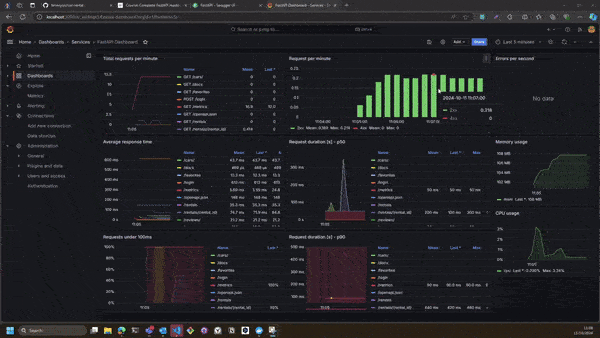

[](#)
[](#)
[](#)
[](#)
[](#)


# Car Rental Backend

## Project Plan

* [Trello board for the project](https://trello.com/b/OkSa33ub/car-rental-project-scrum-board)

## Install pre-commit hooks

```bash
pre-commit install
```

Once set up, pre-commit hooks will run automatically on every commit. The configuration file is `.pre-commit-config.yaml` in the root of the repository.

## Docker build

```bash
docker build -t fastapi-docker .
```

## Docker run

```bash
docker run -d -p 8000:8000 fastapi-docker
```

## Docker Compose

Run all services (FastAPI, Prometheus, Grafana):

```bash
docker-compose up --build
```



Access:
- FastAPI: http://localhost:8000
- Prometheus: http://localhost:9090
- Grafana: http://localhost:3000 (default login: admin/pass@123)




## Database migration using Alembic if needed

A database migration management tool, Alembic can be utilized in the project by following the steps below.

### Step 1: Initialize Alembic

```bash
alembic init alembic
```
The above command initializes Alembic by creating a new directory named `alembic`. This directory contains configuration files and a `versions` folder designated for storing migration scripts.

### Step 2: Create a Migration

```bash
alembic revision --autogenerate -m "Initial migration"
```
The command generates a new migration script within the `versions` folder, reflecting the current state of the database schema. A descriptive message for the migration is provided using the `-m` flag.

### Step 3: Apply the Migration

```bash
alembic upgrade head
```
The command is executed to apply all pending migrations to the database, updating it to the latest version (referred to as "head"). 

### Step 4: Roll Back the Migration

```bash
alembic downgrade -1
```
The command is used to roll back the last applied migration. The number of steps to roll back can be specified by changing the `-1` value to the desired amount.


## Monitoring

Prometheus metrics are automatically collected using prometheus-fastapi-instrumentator. 

Additionally, a default dashboard is configured, and a Prometheus data source has been added in the repository for easy monitoring and visualization of the application metrics.



## References

- [Example: FastAPI, Prometheus, and Grafana Integration](https://github.com/Kludex/fastapi-prometheus-grafana/tree/master)
-  Complete FastAPI Masterclass from Scratch (Udemy)